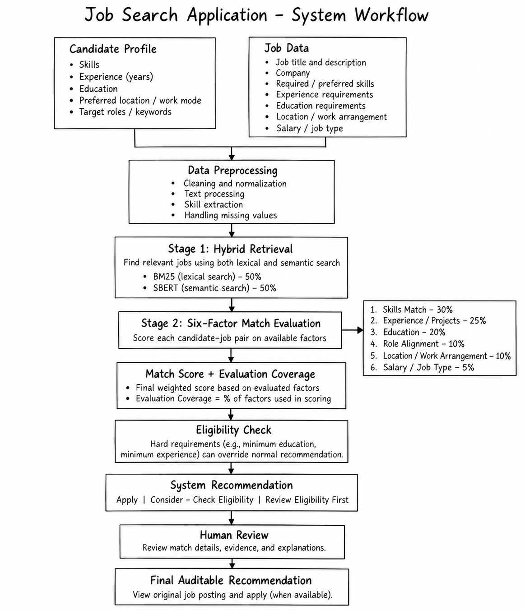
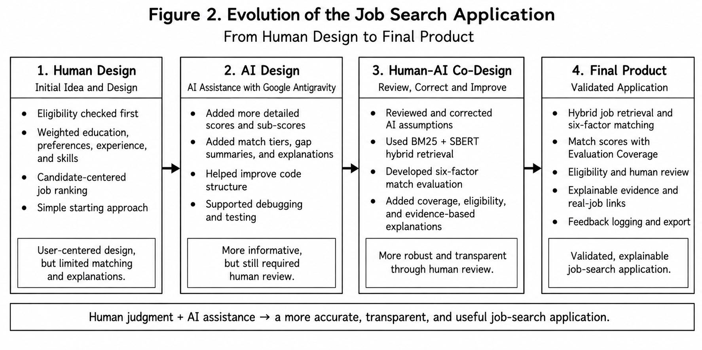
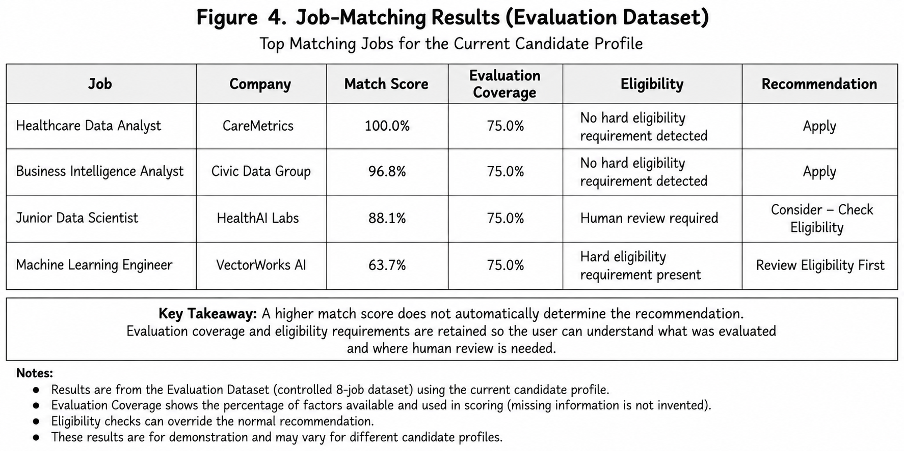
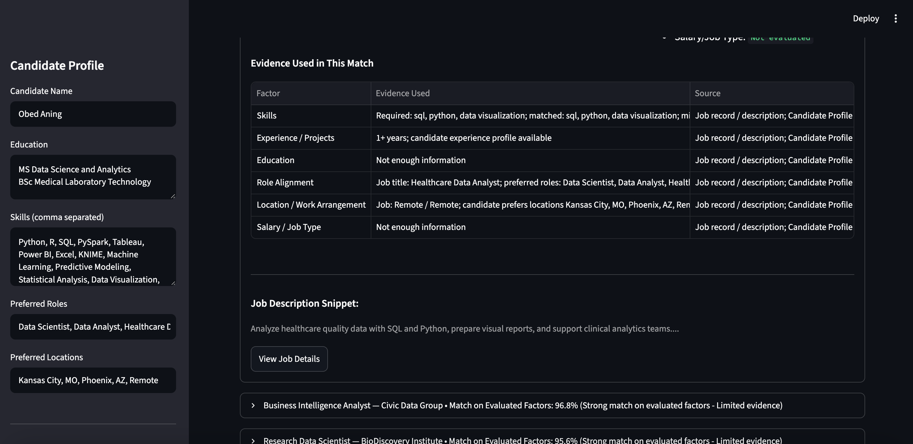

# CS5588 Challenge 1 - Human-AI Co-Designed Job Search

This repository contains the final Human-AI co-designed product for CS5588 Challenge 1. The project evolved through a Human Design -> AI Design -> Human-AI Co-Design -> Final Product workflow, ending in a validated Streamlit application for explainable job matching and human review.

## Problem

The application supports personalized job matching for a candidate seeking data, analytics, healthcare analytics, biomedical informatics, and related roles. The target user is a job seeker or reviewer who wants ranked job matches with transparent scoring, missing-information handling, eligibility review, and a human-in-the-loop final decision.

Candidate inputs include education, skills, preferred roles, preferred locations, work arrangement preferences, job type preferences, and experience profile. Job inputs include title, company, location, work mode, minimum experience, skills, concise job description, source metadata, and optional application URL. Expected outputs include ranked jobs, match score, Evaluation Coverage, skill gaps, eligibility status, System Recommendation, human review decision, Final Auditable Recommendation, detailed evidence, and feedback export.

## Final Workflow

```text
Candidate Profile + Job Data -> Preprocessing -> BM25 + SBERT Hybrid Retrieval -> 6-Factor Match Evaluation -> Coverage + Eligibility -> System Recommendation -> Human Review -> Final Auditable Recommendation
```

## Repository Structure

```text
CS5588-Challenge1-Human-AI-Job-Search/
├── README.md
├── streamlit_app.py
├── requirements.txt
├── .gitignore
├── human_ai_codesign/
│   ├── pipeline.py
│   └── ui_helpers.py
├── notebooks/
│   ├── CS5588_Challenge1_Job_Search_FINAL.ipynb
│   └── Challenge1_Public_Job_Data.ipynb
├── data/
│   └── real_job_snapshot.json
├── tests/
├── results/
│   ├── top8_results.json
│   └── screenshots/
└── docs/
```

### Notebooks

- `CS5588_Challenge1_Job_Search_FINAL.ipynb` - main Challenge 1 notebook documenting the job-search system and its Human Design, AI Design, and Human-AI Co-Design development.
- `Challenge1_Public_Job_Data.ipynb` - data-preparation notebook used to load, inspect, clean, and prepare the Hugging Face public job dataset for retrieval and matching.

## Datasets

The project uses three data sources for different purposes:

- **Hugging Face Public Job Dataset**: `keerthanshetty/resume-skill-extractor-dataset`, containing 3,050 job records. The data was cleaned and normalized, required skills were processed, and searchable job text was prepared for BM25 and SBERT retrieval. Dataset URL: `https://huggingface.co/datasets/keerthanshetty/resume-skill-extractor-dataset`.
- **Evaluation Dataset**: controlled 8-job dataset used for reproducible testing of scoring, Evaluation Coverage, eligibility, and recommendation behavior.
- **Real Job Snapshot**: 5 genuine public job postings captured on September 11, 2026, with application URLs preserved in `data/real_job_snapshot.json`.

Missing information is preserved as unknown rather than invented. Unknown factors are not converted to zero scores.

## Matching Method

### Stage 1: Hybrid Job Retrieval - BM25 + Hugging Face Embeddings

The retrieval stage combines BM25 lexical matching with dense semantic embeddings from `sentence-transformers/all-MiniLM-L6-v2`.

```text
hybrid_score = 50% BM25 + 50% semantic similarity
```

### Stage 2: Six-Factor Match Evaluation

Validated scoring factors and weights:

| Factor | Weight |
|---|---:|
| Skills | 30% |
| Experience / Projects | 25% |
| Education | 20% |
| Role Alignment | 10% |
| Location / Work Arrangement | 10% |
| Salary / Job Type | 5% |

A factor is scored only when sufficient information is available. Unknown factors are excluded from the weighted score, and the remaining active weights are renormalized to 100%. Evaluation Coverage is reported separately to show how much of the full 6-factor assessment could be evaluated. Hard eligibility requirements can override the normal score-based recommendation.

## Human-AI Co-Design

AI-generated ideas and code were reviewed, audited, and corrected through human judgment. The final implementation preserves explainability and avoids unsupported assumptions.

Examples of corrections made during co-design:

- Explicit `work_mode` is used when available.
- Explicit `min_experience` is used when available.
- Education requirements are not fabricated when missing.
- Jobs no longer receive automatic project/domain credit from broad keywords alone.
- Missing factors remain unknown instead of being scored as zero.
- Evidence/source/score explanations were added.
- Human review and override were added to preserve final decision authority.

## Application Features

### Tab 1: Job Search & Matches

- Job Source selector: Evaluation Dataset or Real Job Snapshot.
- Title/keyword, location, and Remote / Hybrid filters.
- Match on Evaluated Factors and Evaluation Coverage.
- Top job recommendations with System Recommendation.
- Human Review Decision and Final Auditable Recommendation.
- Detailed Evidence Used in This Match table.
- Real application links when `job_url` is available.

### Tab 2: How Matches Are Calculated

- Stage 1 retrieval explanation and BM25/SBERT retrieval values.
- Stage 2 six-factor scoring explanation.
- Worked CareMetrics example showing component scores, unknown factors, available weight, weighted sum, renormalized match score, eligibility status, and System Recommendation.

### Tab 3: Feedback

- Select a ranked job.
- Record feedback action and note.
- View logged feedback in the app.
- Download feedback as CSV.

## Visual Evidence

Final job-search workflow/architecture.



Evolution from Human Design to AI Design to Human-AI Co-Design and the final product.



Validated job-matching results from the completed system.



Final Streamlit application showing an explainable job match and the evidence used in the evaluation.



## Installation

Python 3.12 is recommended.

```bash
python3.12 -m venv .venv312
source .venv312/bin/activate
pip install -r requirements.txt
```

## Run the App

```bash
streamlit run streamlit_app.py
```

Streamlit normally opens at `http://localhost:8501`.

## Model Access

The app uses:

```text
sentence-transformers/all-MiniLM-L6-v2
```

The model may download and cache automatically on first use. Later runs can use the local Hugging Face cache.

## Testing

Run:

```bash
pytest -q
```

Current validated result:

```text
40 passed
```

## Example Validated Results

The following Evaluation Dataset results are from `results/top8_results.json`.

| Job | Company | Match on Evaluated Factors | Evaluation Coverage | Eligibility Status | System Recommendation |
|---|---|---:|---:|---|---|
| Healthcare Data Analyst | CareMetrics | 100.0% | 75.0% | No hard eligibility requirement detected | Apply |
| Business Intelligence Analyst | Civic Data Group | 96.8% | 75.0% | No hard eligibility requirement detected | Apply |
| Junior Data Scientist | HealthAI Labs | 88.1% | 75.0% | Human review required | Consider - Check Eligibility |
| Machine Learning Engineer | VectorWorks AI | 63.7% | 75.0% | Hard eligibility requirement present | Review Eligibility First |

## Real Job Snapshot

The Real Job Snapshot contains five public jobs captured on 2026-09-11. Application links are preserved in the local snapshot so the app can display `View Original Posting / Apply` when a valid URL exists.

The snapshot is local for reproducibility. Public postings may later expire, change, or redirect.

## Limitations

- The controlled Evaluation Dataset contains only 8 jobs.
- The Real Job Snapshot is not a live job API.
- Some public postings have incomplete structured requirements.
- Match percentages must be interpreted together with Evaluation Coverage.
- Application submission is not automated.

## Future Work

Possible extensions include:

- Live job APIs.
- Resume parsing.
- Persistent user profiles.
- Richer eligibility fields.
- Skill-gap recommendations.
- Agentic job search and application support.

## Reproducibility

- Notebooks: `notebooks/`
- Tests: `tests/`
- Data snapshot: `data/real_job_snapshot.json`
- Validated results: `results/top8_results.json`
- Screenshots: `results/screenshots/`
- Supporting docs: `docs/`

The final app state was manually validated across all three tabs: Job Search & Matches, How Matches Are Calculated, and Feedback.
